# Spring Boot Sample Project

<!-- TOC -->

- [Spring Boot Sample Project](#spring-boot-sample-project)
    - [多模块spring boot2.0项目搭建](#多模块spring-boot20项目搭建)
        - [创建SpringBoot 2.0项目](#创建springboot-20项目)
        - [创建多模块](#创建多模块)
        - [项目启动](#项目启动)
    - [附录](#附录)

<!-- /TOC -->

```text
这是一个spring boot的示例项目，用以展示spring boot之美
```

## 多模块spring boot2.0项目搭建

```text
创建一个基于spring boot 2.0的多模块maven项目
```

### 创建SpringBoot 2.0项目

1. 打开File -> New -> Project...
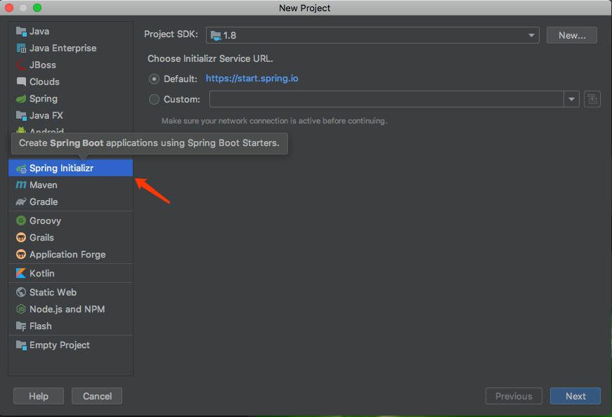
2. 输入包名，项目名 group即为包名 artifact为项目名
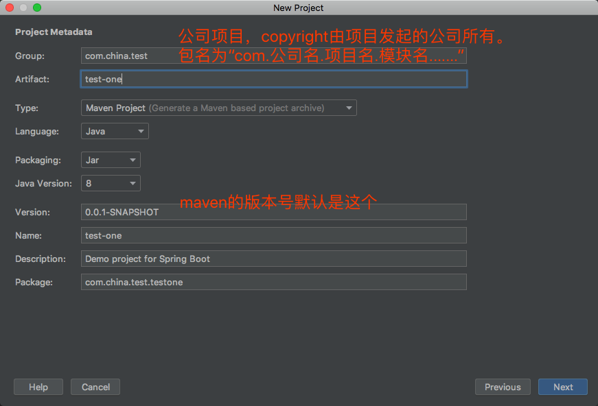
3. spring boot项目由各种依赖组成，可选一些自己想添加的，也可以不添加，后面我们还可以再添加
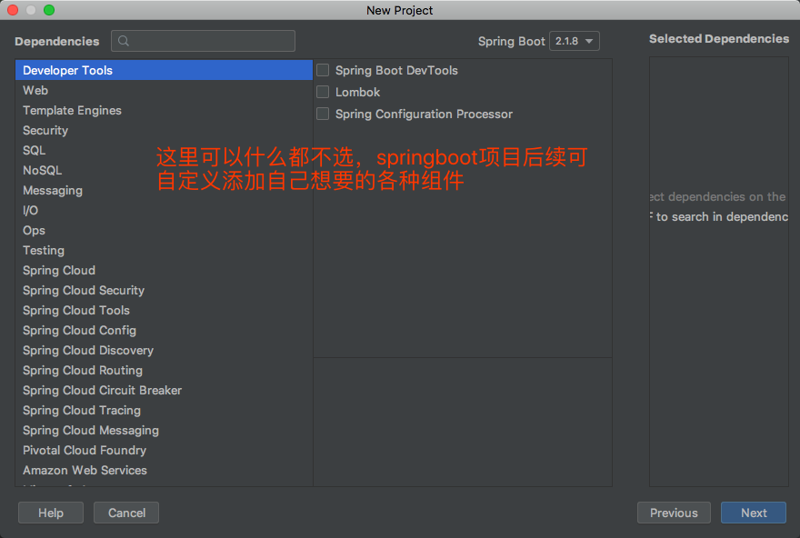
4. 设置好项目名之后，我们的项目就搭建完成了
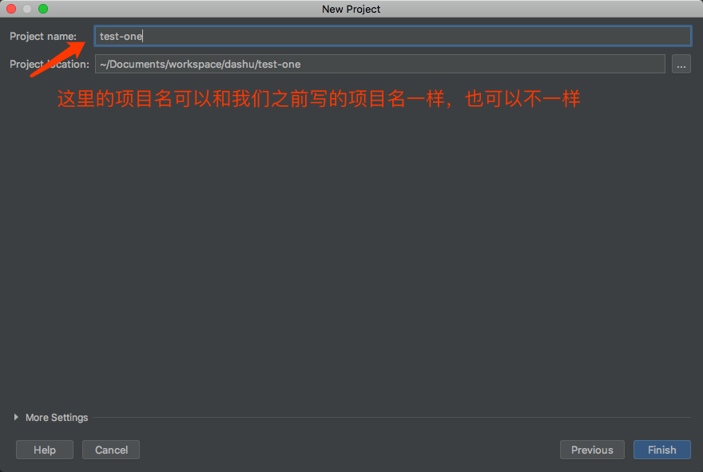
5. 一开始，项目是长这样的，我们删除红框中的所有文件，只留下.gitignore pom.xml .idea test-one.iml这几个文件
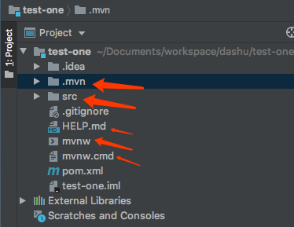
6. 最终我们的项目变成了这个样子
记得在pom.xml中如图所示，添加一个打包方式

```text
<packaging>pom</packaging>
```

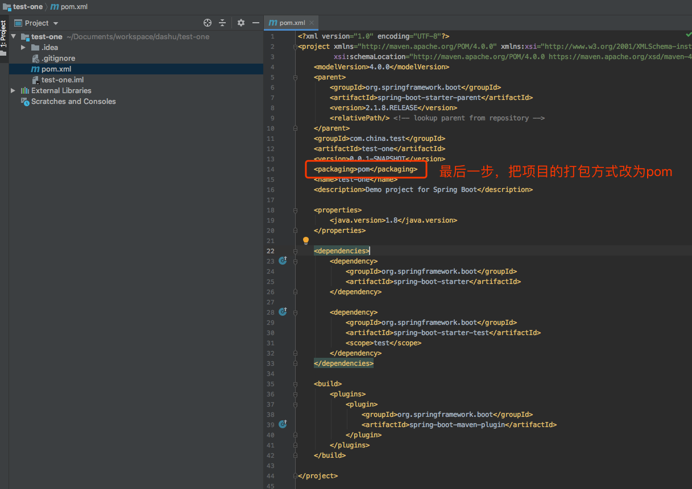

### 创建多模块

```text
接下来，我们开始创建其它模块，关于java模块怎么划分，
具体可以查看附录中的[java项目分层]这篇文章
```

1. 打开模块创建窗口
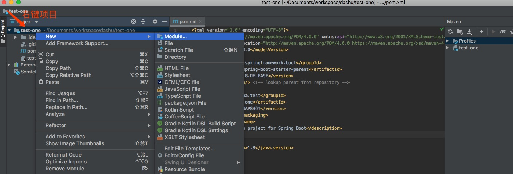
2. 我们选择建用maven方式创建模块
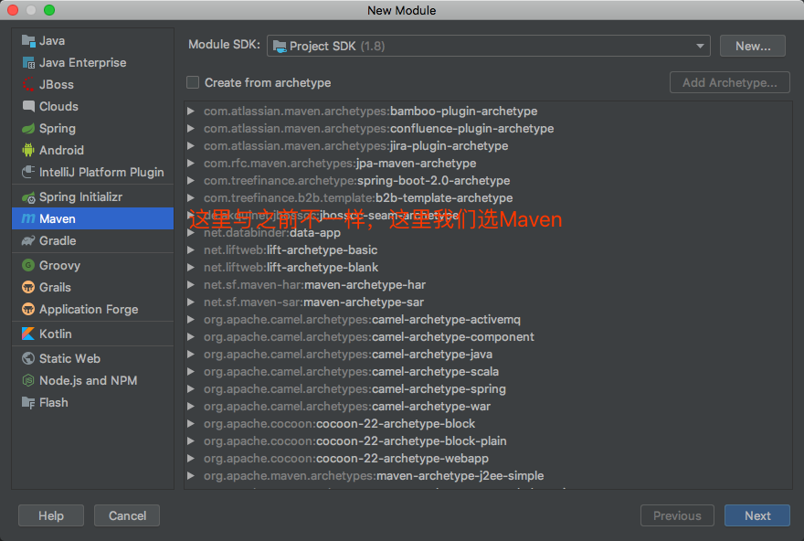
3. 输入模块名
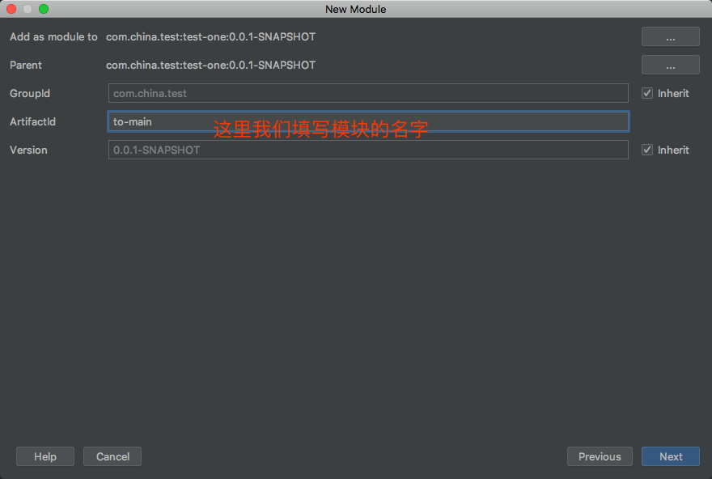
4. 确认模块所在目录
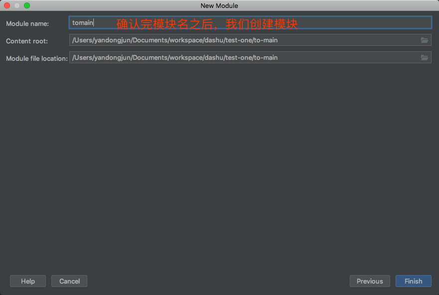
5. 完成项目创建，模块最终是这样的
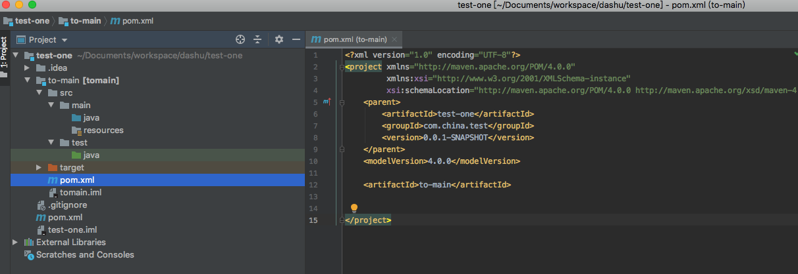
6. 项目最终成型，按相同方法，创建controller, service, dao, common 等模块


### 项目启动

```text
项目基础架构已经搭建完成了，之后就是将项目跑起来
```

1. 修改项目根pom.xml文件(就是最外面的那个pom文件)，我们另外建了一个controller模块
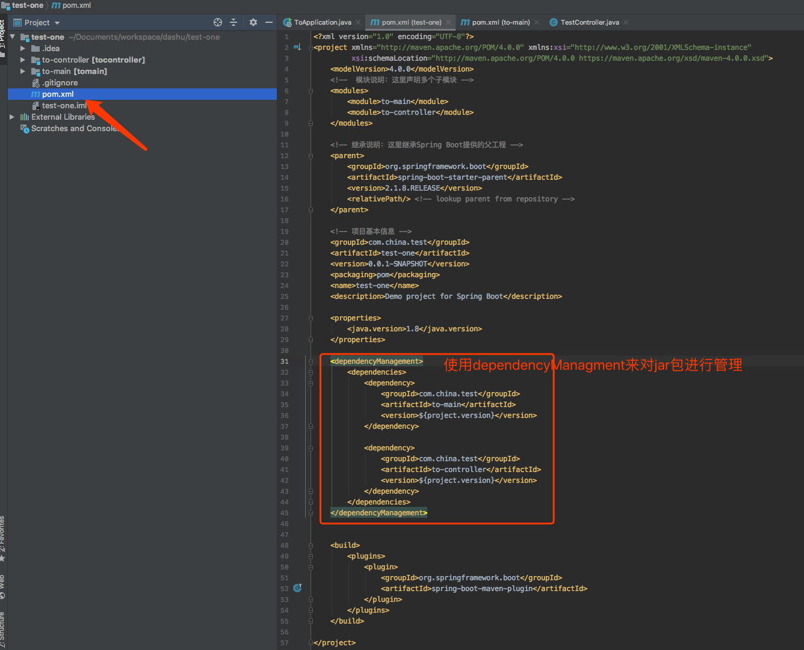

2. 在controller模块的pom文件中添加如下内容，其它文件请参阅项目源码
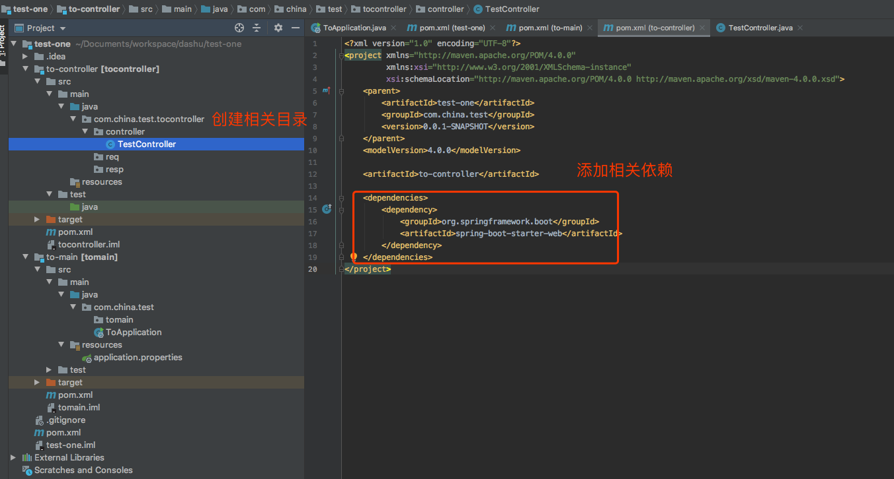

3. 修改main模块的pom.xml文件，添加如下内容
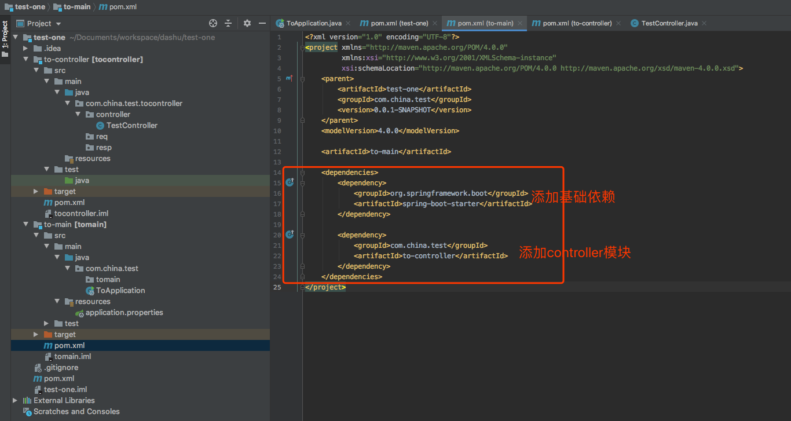

4. 在main模块中添加以下3个文件(具体文件内容请自行查看项目源码)
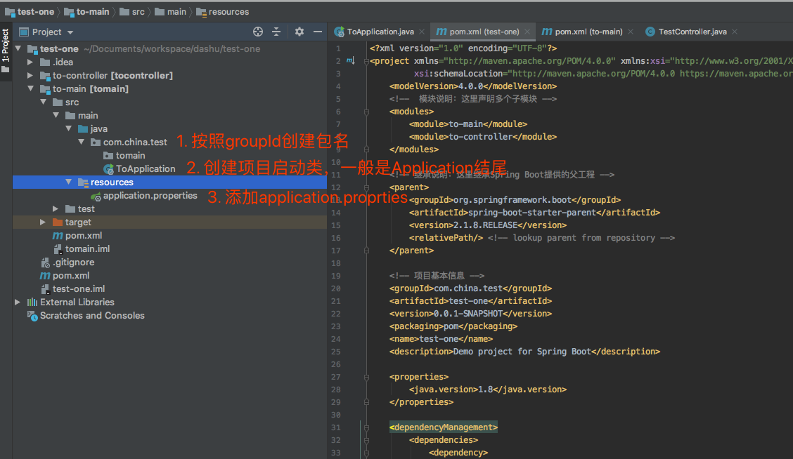

5. 启动项目
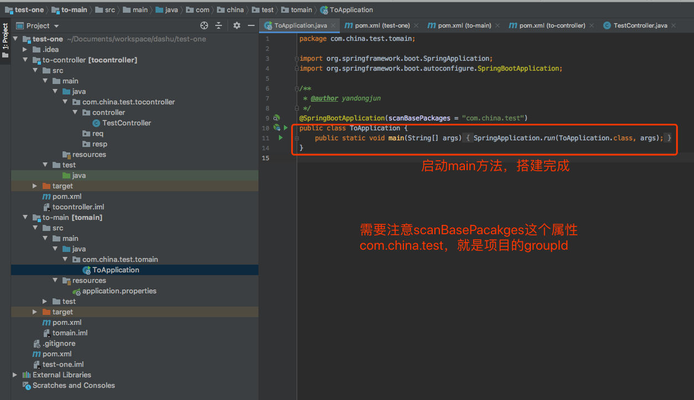

## 附录

[spring-boot 多模块项目搭建](https://symonlin.github.io/2019/01/15/springboot-1/)

[java项目分层](https://www.jianshu.com/p/9ef2005a0001)
