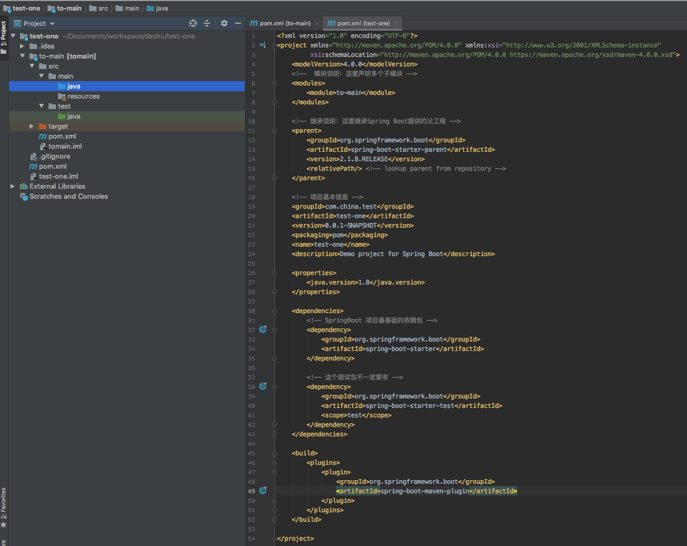
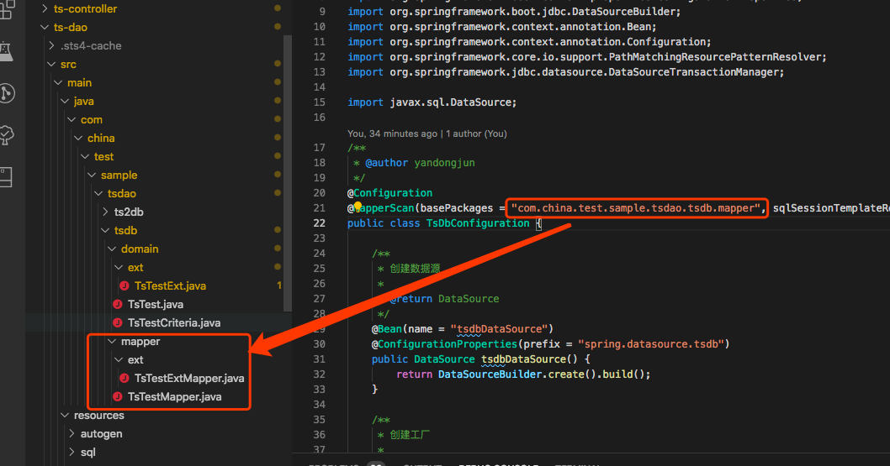

# 1. Spring Boot Sample Project

<!-- TOC -->

- [Spring Boot Sample Project](#spring-boot-sample-project)
  - [多模块 spring boot2.0 项目搭建](#%E5%A4%9A%E6%A8%A1%E5%9D%97-spring-boot20-%E9%A1%B9%E7%9B%AE%E6%90%AD%E5%BB%BA)
    - [创建 SpringBoot 2.0 项目](#%E5%88%9B%E5%BB%BA-springboot-20-%E9%A1%B9%E7%9B%AE)
    - [创建多模块](#%E5%88%9B%E5%BB%BA%E5%A4%9A%E6%A8%A1%E5%9D%97)
    - [项目启动](#%E9%A1%B9%E7%9B%AE%E5%90%AF%E5%8A%A8)
  - [第一个 restful 接口](#%E7%AC%AC%E4%B8%80%E4%B8%AA-restful-%E6%8E%A5%E5%8F%A3)
    - [定义一个 restful 接口](#%E5%AE%9A%E4%B9%89%E4%B8%80%E4%B8%AA-restful-%E6%8E%A5%E5%8F%A3)
    - [RequestMapping 基础用法](#requestmapping-%E5%9F%BA%E7%A1%80%E7%94%A8%E6%B3%95)
    - [RequestMapping 处理多个 url](#requestmapping-%E5%A4%84%E7%90%86%E5%A4%9A%E4%B8%AA-url)
    - [RequestMapping 中带参数](#requestmapping-%E4%B8%AD%E5%B8%A6%E5%8F%82%E6%95%B0)
    - [RequestMapping 中的关键字 required, defaultValue](#requestmapping-%E4%B8%AD%E7%9A%84%E5%85%B3%E9%94%AE%E5%AD%97-required-defaultvalue)
    - [RequestMapping 处理各种 HTTP 方法](#requestmapping-%E5%A4%84%E7%90%86%E5%90%84%E7%A7%8D-http-%E6%96%B9%E6%B3%95)
    - [RequestMapping 通过 url 获取参数](#requestmapping-%E9%80%9A%E8%BF%87-url-%E8%8E%B7%E5%8F%96%E5%8F%82%E6%95%B0)
    - [RequestMapping 通过 RequestBody 来传递参数](#requestmapping-%E9%80%9A%E8%BF%87-requestbody-%E6%9D%A5%E4%BC%A0%E9%80%92%E5%8F%82%E6%95%B0)
    - [RequestMapping 通过 RequestBody 来传递参数 2](#requestmapping-%E9%80%9A%E8%BF%87-requestbody-%E6%9D%A5%E4%BC%A0%E9%80%92%E5%8F%82%E6%95%B0-2)
    - [总结](#%E6%80%BB%E7%BB%93)
  - [如何在 Dao 层与数据库打交道](#%E5%A6%82%E4%BD%95%E5%9C%A8-dao-%E5%B1%82%E4%B8%8E%E6%95%B0%E6%8D%AE%E5%BA%93%E6%89%93%E4%BA%A4%E9%81%93)
    - [使用 SpringBoot 自带的功能快捷的查询数据库数据未完成，先不看](#%E4%BD%BF%E7%94%A8-springboot-%E8%87%AA%E5%B8%A6%E7%9A%84%E5%8A%9F%E8%83%BD%E5%BF%AB%E6%8D%B7%E7%9A%84%E6%9F%A5%E8%AF%A2%E6%95%B0%E6%8D%AE%E5%BA%93%E6%95%B0%E6%8D%AE%E6%9C%AA%E5%AE%8C%E6%88%90%E5%85%88%E4%B8%8D%E7%9C%8B)
    - [使用 mybatis 插件帮我们自动生成数据库操作语句](#%E4%BD%BF%E7%94%A8-mybatis-%E6%8F%92%E4%BB%B6%E5%B8%AE%E6%88%91%E4%BB%AC%E8%87%AA%E5%8A%A8%E7%94%9F%E6%88%90%E6%95%B0%E6%8D%AE%E5%BA%93%E6%93%8D%E4%BD%9C%E8%AF%AD%E5%8F%A5)
      - [mybatis 自动生成代码插件如何配置使用](#mybatis-%E8%87%AA%E5%8A%A8%E7%94%9F%E6%88%90%E4%BB%A3%E7%A0%81%E6%8F%92%E4%BB%B6%E5%A6%82%E4%BD%95%E9%85%8D%E7%BD%AE%E4%BD%BF%E7%94%A8)
      - [如果将这些文件加载到 springboot 项目中进行使用](#%E5%A6%82%E6%9E%9C%E5%B0%86%E8%BF%99%E4%BA%9B%E6%96%87%E4%BB%B6%E5%8A%A0%E8%BD%BD%E5%88%B0-springboot-%E9%A1%B9%E7%9B%AE%E4%B8%AD%E8%BF%9B%E8%A1%8C%E4%BD%BF%E7%94%A8)
  - [模板页面使用-第一个模板页面](#%E6%A8%A1%E6%9D%BF%E9%A1%B5%E9%9D%A2%E4%BD%BF%E7%94%A8-%E7%AC%AC%E4%B8%80%E4%B8%AA%E6%A8%A1%E6%9D%BF%E9%A1%B5%E9%9D%A2)
    - [在 pom.xml 中引入 thymeleaf 等依赖](#%E5%9C%A8-pomxml-%E4%B8%AD%E5%BC%95%E5%85%A5-thymeleaf-%E7%AD%89%E4%BE%9D%E8%B5%96)
    - [关闭 thymeleaf 缓存](#%E5%85%B3%E9%97%AD-thymeleaf-%E7%BC%93%E5%AD%98)
    - [创建第一个模板文件](#%E5%88%9B%E5%BB%BA%E7%AC%AC%E4%B8%80%E4%B8%AA%E6%A8%A1%E6%9D%BF%E6%96%87%E4%BB%B6)
    - [访问我们的第一个模板页面](#%E8%AE%BF%E9%97%AE%E6%88%91%E4%BB%AC%E7%9A%84%E7%AC%AC%E4%B8%80%E4%B8%AA%E6%A8%A1%E6%9D%BF%E9%A1%B5%E9%9D%A2)
  - [模板页面使用-查询](#%E6%A8%A1%E6%9D%BF%E9%A1%B5%E9%9D%A2%E4%BD%BF%E7%94%A8-%E6%9F%A5%E8%AF%A2)
    - [创建查询展示页面](#%E5%88%9B%E5%BB%BA%E6%9F%A5%E8%AF%A2%E5%B1%95%E7%A4%BA%E9%A1%B5%E9%9D%A2)
    - [查询数据](#%E6%9F%A5%E8%AF%A2%E6%95%B0%E6%8D%AE)
    - [浏览列表展示页面](#%E6%B5%8F%E8%A7%88%E5%88%97%E8%A1%A8%E5%B1%95%E7%A4%BA%E9%A1%B5%E9%9D%A2)
  - [模板页面使用-增、删、改](#%E6%A8%A1%E6%9D%BF%E9%A1%B5%E9%9D%A2%E4%BD%BF%E7%94%A8-%E5%A2%9E%E5%88%A0%E6%94%B9)
    - [创建一个具有增删改的页面](#%E5%88%9B%E5%BB%BA%E4%B8%80%E4%B8%AA%E5%85%B7%E6%9C%89%E5%A2%9E%E5%88%A0%E6%94%B9%E7%9A%84%E9%A1%B5%E9%9D%A2)
    - [实现一个删除操作](#%E5%AE%9E%E7%8E%B0%E4%B8%80%E4%B8%AA%E5%88%A0%E9%99%A4%E6%93%8D%E4%BD%9C)
    - [实现一个添加操作](#%E5%AE%9E%E7%8E%B0%E4%B8%80%E4%B8%AA%E6%B7%BB%E5%8A%A0%E6%93%8D%E4%BD%9C)
    - [实现一个修改操作](#%E5%AE%9E%E7%8E%B0%E4%B8%80%E4%B8%AA%E4%BF%AE%E6%94%B9%E6%93%8D%E4%BD%9C)
  - [手动修改 maven 项目版本号](#%E6%89%8B%E5%8A%A8%E4%BF%AE%E6%94%B9-maven-%E9%A1%B9%E7%9B%AE%E7%89%88%E6%9C%AC%E5%8F%B7)
  - [附录](#%E9%99%84%E5%BD%95)

<!-- /TOC -->

```text
这是一个spring boot的示例项目，用以展示spring boot之美
```

## 1.1. 多模块 spring boot2.0 项目搭建

```text
创建一个基于spring boot 2.0的多模块maven项目
```

### 1.1.1. 创建 SpringBoot 2.0 项目

1. 打开 File -> New -> Project...
   
2. 输入包名，项目名 group 即为包名 artifact 为项目名
   
3. spring boot 项目由各种依赖组成，可选一些自己想添加的，也可以不添加，后面我们还可以再添加
   
4. 设置好项目名之后，我们的项目就搭建完成了
   
5. 一开始，项目是长这样的，我们删除红框中的所有文件，只留下.gitignore pom.xml .idea test-one.iml 这几个文件
   
6. 最终我们的项目变成了这个样子
   记得在 pom.xml 中如图所示，添加一个打包方式

```text
<packaging>pom</packaging>
```


### 1.1.2. 创建多模块

```text
接下来，我们开始创建其它模块，关于java模块怎么划分，
具体可以查看附录中的[java项目分层]这篇文章
```

1. 打开模块创建窗口
   
2. 我们选择建用 maven 方式创建模块
   
3. 输入模块名
   
4. 确认模块所在目录
   
5. 完成项目创建，模块最终是这样的
   
6. 项目最终成型，按相同方法，创建 controller, service, dao, common 等模块
   

### 1.1.3. 项目启动

```text
项目基础架构已经搭建完成了，之后就是将项目跑起来
```

1. 修改项目根 pom.xml 文件(就是最外面的那个 pom 文件)，我们另外建了一个 controller 模块
   

2. 在 controller 模块的 pom 文件中添加如下内容，其它文件请参阅项目源码
   

3. 修改 main 模块的 pom.xml 文件，添加如下内容
   

4. 在 main 模块中添加以下 3 个文件(具体文件内容请自行查看项目源码)
   

5. 启动项目
   

## 1.2. 第一个 restful 接口

```text
SpringBoot项目创建完成之后，可以简单的通过几个注解就完成一个restful接口的定义，我们一起来看一下
```

### 1.2.1. 定义一个 restful 接口

1.如图，创建一个 controller 类，并实现一些基础的方法

```text
需要说明的是
application.properties里配置项
#系统名称
server.servlet.context-path = /ts
#sso系统服务地址
server.port = 8889

平常访问链接，需要
http://ip:{server.port}/{server.servlet.context-path}/
某个controller的外层path/方法path

例：
http://localhost:8889/ts/test/getSomething
```


2.我们来尝试一下接口调用


### 1.2.2. RequestMapping 基础用法

```text
感觉一下图例中的2个链接的结果我们不难发现，
http://localhost:8889/ts/test是404没有定义
http://localhost:8889/ts/test/ 可正常返回结果
```


### 1.2.3. RequestMapping 处理多个 url

```code
    /**
     * http://ip:port/ts/test/
     * http://ip:port/ts/test/get
     * http://ip:port/ts/test/get1
     * http://ip:port/ts/test/get2
     *
     * @return
     */
    @RequestMapping(path = { "get", "get1", "get2" })
    public String get0() {
        return "OK";
    }
```

### 1.2.4. RequestMapping 中带参数


### 1.2.5. RequestMapping 中的关键字 required, defaultValue


### 1.2.6. RequestMapping 处理各种 HTTP 方法

```text
常用的HTTP METHOD

后面的method可省略，用GetMapping等代替
```


### 1.2.7. RequestMapping 通过 url 获取参数

```text
restful接口的精髓在于通过url来获取参数，如

http://ip:port/ts/test/get/userinfo/1

http://ip:port/ts/test/get/userinfo/{userId}

```


### 1.2.8. RequestMapping 通过 RequestBody 来传递参数

```text
restful接口可通过http的body来传递参数，如
http://localhost:8889/ts/test/getMomoGifts
```


### 1.2.9. RequestMapping 通过 RequestBody 来传递参数 2

```text
restful接口可通过http的body来传递参数，如
http://localhost:8889/ts/test/getMomoGifts2

这里与上面不一样的地方在于，上面直接将传入的json数据转成了map，我们这个方法将json数据转成一个对象
```


需要说明的是，json 中的 key 值要与对象中的参数的名字一样才能被识别

```json
{
  "userName": "yandongjun",
  "age": 18
}
```


### 1.2.10. 总结

```text
本章我们讲了如下内容
1. http有哪些方法
2. 同样的定义可以有不一样的写法，如method = post可替换成直接用PostMapping
3. 可以用url来对参数进行传递
4. RequestBody传递参数时，Key传要与对象中的属性名称一致才可以被识别
```

## 1.3. 如何在 Dao 层与数据库打交道

```text
本章节，我们地讲解
1. 如何使用SpringBoot自带的功能快捷的查询数据库数据
2. 如何使用mybatis框架帮我们自动生成数据库操作语句并完成查询
3. 如何使用mybatis编写自定义的sql语句
```

### 1.3.1. 使用 SpringBoot 自带的功能快捷的查询数据库数据(未完成，先不看)

1.首先，我们要在 parent 模块的 pom.xml 文件中引入数据库相关的 jar 包

```text
<dependency>
    <groupId>mysql</groupId>
    <artifactId>mysql-connector-java</artifactId>
    <version>8.0.17</version>
</dependency>
```

2.在 main 模块的 application.properties 文件中，我们需要配置数据库相关的配置

```text

```

### 1.3.2. 使用 mybatis 插件帮我们自动生成数据库操作语句

在开始这一章节之前，我们假设已经完成了数据库的创建，表的创建

#### 1.3.2.1. mybatis 自动生成代码插件如何配置使用

1.首先，我们在 dao 层添加一些依赖,先在 parent 下的 pom 中进行定义，之后在 dao 模块进行引用(这里不作赘述，注意版本号)

```text
       <dependency>
            <groupId>org.mybatis.spring.boot</groupId>
            <artifactId>mybatis-spring-boot-starter</artifactId>
        </dependency>

        <dependency>
            <groupId>org.springframework.boot</groupId>
            <artifactId>spring-boot-starter-jdbc</artifactId>
        </dependency>

        <dependency>
            <groupId>mysql</groupId>
            <artifactId>mysql-connector-java</artifactId>
            <scope>provided</scope>
        </dependency>
```

2.其次，我们得把 Mybatis 自动生成文件的插件引用进来

```text
    <build>
        <plugins>
            <plugin>
                <groupId>org.mybatis.generator</groupId>
                <artifactId>mybatis-generator-maven-plugin</artifactId>
                <version>${mybatis-generator-maven-plugin.version}</version>
                <dependencies>
                    <dependency>
                        <groupId>mysql</groupId>
                        <artifactId>mysql-connector-java</artifactId>
                        <version>${mysql-driver.version}</version>
                    </dependency>
                </dependencies>

                <configuration>
                    <!-- 大家注意，这里的目录其实就是dao模块下的resources目录 -->
                    <configurationFile>src/main/resources/autogen/generatorConfig.xml</configurationFile>
                    <overwrite>true</overwrite>
                </configuration>
            </plugin>
        </plugins>
    </build>
```

3.接下来，我们添加插件需要使用到的文件 generatorConfig.xml,观察一下上面插件的引用，里面的 configuration
配置了这个文件的路径

```text
        <!-- 配置domain类的包名 -->
        <javaModelGenerator targetPackage="com.china.test.sample.tsdao.tsdb.domain"
                            targetProject="src/main/java/"><!-- src/generated/java -->
            <property name="enableSubPackages" value="true"/>
            <property name="trimStrings" value="true"/>
        </javaModelGenerator>

        <!-- 配置mapper.xml文件的路径 -->
        <sqlMapGenerator targetPackage="tsdb"
                         targetProject="src/main/resources/sqlmap/"> <!-- src/generated/resources -->
            <property name="enableSubPackages" value="true"/>
        </sqlMapGenerator>

        <!-- 配置mapper类的包名 -->
        <javaClientGenerator type="XMLMAPPER" targetPackage="com.china.test.sample.tsdao.tsdb.mapper"
                             targetProject="src/main/java/"> <!-- src/generated/java -->
            <property name="enableSubPackages" value="true"/>
        </javaClientGenerator>

        <!-- 配置要自动生成的表, 后面的domainObjectName就是生成的java类的名称 -->
        <table schema="test" tableName="ts_test" domainObjectName="TsTest">
            <property name="useActualColumnNames" value="true"/>
        </table>
```

4.开始生成文件

```text
4.1 数据库建表，可以使用init.sql文件中的建表语句，也可以使用自己自定义的建表语句
4.2 使用如下方式生成文件(需要在dao模块的根目录下，就是有pom.xml文件的目录下)
mvn mybatis-generator:generate
```


```text
也可以使用idea自带的插件执行, 如下图所示
```


#### 1.3.2.2. 如果将这些文件加载到 springboot 项目中进行使用

1.先确定自动生成的文件在哪

```text
我们在生成文件之后，大家可以在这3个目录下看到相应的文件
domain类目录
src/main/java/
com.china.test.sample.tsdao.tsdb.domain

mapper类目录
src/main/java/
com.china.test.sample.tsdao.tsdb.mapper

mapper.xml文件目录
src/main/resources/sqlmap/tsdb

如下图
```


2.如何让 springboot 项目知道这 3 种文件在哪

```text
我们直接在这里讲述多数据源的添加
具体的配置大家可以查看以下2个类
TsDbConfiguration
Ts2DbConfiguration
```

2.1 在 application.properties 配置文件中配置数据库信息，如下

```text
不难发现，每个数据库配置都有统一的前缀
spring.datasource.tsdb
spring.datasource.ts2db

他们都有固定的4类属性(还有许多其它数据库属性，自行搜索添加)
jdbc-url
username
password
driver-class
```

```text
 数据库url
spring.datasource.tsdb.jdbc-url=jdbc:mysql://192.168.5.241:3306/test?useSSL=false
# 数据库用户名
spring.datasource.tsdb.username=root
# 数据库密码
spring.datasource.tsdb.password=dashu0701
# 数据库驱动
spring.datasource.tsdb.driver-class-name=com.mysql.jdbc.Driver

# 数据库url
spring.datasource.ts2db.jdbc-url=jdbc:mysql://192.168.5.241:3306/test2?useSSL=false
# 数据库用户名
spring.datasource.ts2db.username=root
# 数据库密码
spring.datasource.ts2db.password=dashu0701
# 数据库驱动
spring.datasource.ts2db.driver-class-name=com.mysql.jdbc.Driver
```

2.2 我们回到 TsDbConfiguration 类

2.2.1 我们在配置数据源的时候，将配置的前缀加上，数据源就配好了


2.2.2 之后我们要关注的是我们的 mapper 类的配置



2.2.3 然后看一下我们的 mapper.xml 的配置


2.2.4 到这我们写一个测试类来测试一下(测试类有 2 种写法，我们这拿 junit 方式来作讲解)

```text
查看以下类的实现
TestTsTestWithJunit
```


## 1.4. 模板页面使用-第一个模板页面

```text
我们分三步
1 在pom.xml中引入thymeleaf
2 关闭thymeleaf缓存
3 创建第一个模板文件
```

### 1.4.1. 在 pom.xml 中引入 thymeleaf 等依赖

```text
在web模块下的pom.xml文件中我们添加如下依赖
 <!-- 在web模块的pom.xml文件中，我们添加依赖 -->
<dependency>
    <groupId>org.springframework.boot</groupId>
    <artifactId>spring-boot-starter-thymeleaf</artifactId>
</dependency>
<dependency>
    <groupId>org.springframework.boot</groupId>
    <artifactId>spring-boot-starter-web</artifactId>
</dependency>

在main目录下的pom.xml文件中我们添加如下依赖
<dependency>
    <groupId>com.china.test.sample</groupId>
    <artifactId>ts-web</artifactId>
</dependency>
```

### 1.4.2. 关闭 thymeleaf 缓存

```text
在application.properties配置文件中我们加入以下配置

# 我们在开发阶段，把缓存去掉，要不我们的页面修改无法实时在我们的浏览器中生效
########################################################
###THYMELEAF (ThymeleafAutoConfiguration)
########################################################
#spring.thymeleaf.prefix=classpath:/templates/
#spring.thymeleaf.suffix=.html
#spring.thymeleaf.mode=HTML5
#spring.thymeleaf.encoding=UTF-8
# ;charset=<encoding> is added
#spring.thymeleaf.content-type=text/html
# set to false for hot refresh
spring.thymeleaf.cache=false
```

### 1.4.3. 创建第一个模板文件

```text
1. 我们的所有模板页面，默认目录在resources/templates/下
我们在web模块的resources目录下创建templates目录

2. 我们创建HelloWorld.html文件，内容如下
<!DOCTYPE html>
<html xmlns="http://www.w3.org/1999/xhtml" xmlns:th="http://www.thymeleaf.org"
>
<head>
    <title>Hello World!</title>
</head>
<body>
<h1 th:inline="text">Hello.v.2</h1>
<p th:text="${HelloWorld}"></p>
</body>
</html>

3. 我们在web模块下创建controller类
@Controller
@RequestMapping("/web")
public class HelloWorldController {
    /**
     * 返回html模板.
     */
    @RequestMapping("/HelloWorld")
    public String HelloWorld(Map<String, Object> map) {
        // 这里的HelloWorld是与模板文件中的 ${HelloWorld} 对应的，最后会被这段话替换掉
        map.put("HelloWorld", "这里的HelloWorld是与模板文件中的 ${HelloWorld} 对应的，最后会被这段话的替换掉");
        // 这里返回的值是templates目录下的文件名，不要带后文件后缀名
        return "/HelloWorld";
    }

}
```

### 1.4.4. 访问我们的第一个模板页面

```text
打开浏览器访问我们的第一个模板页面
http://localhost:8889/ts/web/HelloWorld
```

## 1.5. 模板页面使用-查询

```text
1. 在resources/templates目录中添加ShowTestInfo.html页面
2. 在TsTestController中添加ShowTestInfo方法
```

### 1.5.1. 创建查询展示页面

```text
<!DOCTYPE html>
<html lang="en" xmlns:th="http://www.thymeleaf.org">
<head>
    <meta charset="UTF-8">
    <title>用于展示信息的页面</title>
</head>
<body>
<table border="1">
    <tr>
        <td>用户名</td>
        <td>年龄</td>
    </tr>
    <!--/*@thymesVar id="tsTestVOs" type="java.util.List"*/-->
    <tr th:each="tsTestVO : ${tsTestVOs}">
        <td th:text="${tsTestVO.name}"></td>
        <td th:text="${tsTestVO.extraInfo}"></td>
    </tr>
</table>
</body>
</html>
```

### 1.5.2. 查询数据

```text
1 通过map形式传递页面数据
    /**
     * http://localhost:8889/ts/tsTest/ShowTestInfo
     */
    @RequestMapping("/ShowTestInfo")
    public String ShowTestInfo(Map<String, Object> map) {
        List<TsTestVO> tsTestVOs = tsTestService.getTsTestVOListForShowTestInfo();
        map.put("tsTestVOs", tsTestVOs);
        // 这里返回的值是templates目录下的文件名，不要带后文件后缀名
        return "ShowTestInfo";
    }

2 通过model形式传递页面数据
    /**
     * 使用model，最后SpringBoot会将model转成map(具体可以看接口Model的asMap方法)，和上面的方法一样
     * <p>
     * http://localhost:8889/ts/tsTest/ShowTestInfo2
     */
    @RequestMapping("/ShowTestInfo2")
    public String ShowTestInfo2(Model model) {
        List<TsTestVO> tsTestVOs = tsTestService.getTsTestVOListForShowTestInfo();
        model.addAttribute("tsTestVOs", tsTestVOs);
        // 这里返回的值是templates目录下的文件名，不要带后文件后缀名
        return "ShowTestInfo";
    }

3 从数据库中获取数据进行传递
    /**
     * 我们从数据库中获取数据并展示
     * <p>
     * 1. 使用service层的方法获取数据
     * <p>
     * 2. service层将获取的结果数据转换成前端展示类TsTestVO(view)
     * <p>
     * 3. service层方法调用dao层方法获取数据
     * <p>
     * 4. dao层其实就是我们的mapper类
     * <p>
     * http://localhost:8889/ts/tsTest/ShowTestInfo3
     */
    @RequestMapping("/ShowTestInfo3")
    public String ShowTestInfo3(Model model) {
        List<TsTestVO> tsTestVOs = tsTestService.getTsTestVOListForShowTestInfo3();
        model.addAttribute("tsTestVOs", tsTestVOs);
        // 这里返回的值是templates目录下的文件名，不要带后文件后缀名
        return "ShowTestInfo";
    }
```

### 1.5.3. 浏览列表展示页面

```text
1. http://localhost:8889/ts/tsTest/ShowTestInfo
2. http://localhost:8889/ts/tsTest/ShowTestInfo2
```


```text
3. http://localhost:8889/ts/tsTest/ShowTestInfo3
```


## 1.6. 模板页面使用-增、删、改

```text
1. 创建具有增删改的页面
2. 实现一个删除操作
3. 实现一个添加操作
4. 实现一个修改操作
```

### 1.6.1 创建一个具有增删改的页面

```text
具体查看CrudTemplate.html
```

### 1.6.2 实现一个删除操作

```text
具体查看CrudTemplate.html

以下是具体的代码，需要注意的是，删除需要将这条数据的id传递给后台

<!-- 这里是模板规定的写法, 这里删除不需要页面展示 ，所以直接调用删除接口 -->
<td><a th:href="@{'/tsTest/delTsTest/'+${tsTest.id}}">删除</a></td>
```

### 1.6.3 实现一个添加操作

```text
具体查看
CrudTemplate.html

<a href="/ts/tsTest/jumpToAddPage">添加数据</a>

AddTemplate.html

一个提交，我们需要将所有数据通过一个form表单进行提交，具体的写法如下

<form action="/ts/tsTest/addTsTest" method="post" th:object="${tsTestModel.tsTest}">
        <td>
            <!-- 隐藏属性 -->
            <input type="hidden" name="id" th:value="*{id}">
        </td>

        <td>
            名字:
            <input type="text" name="userName" th:value="*{userName}">
        </td>

        <td>
            年龄:
            <input type="text" name="age" th:value="*{age}">
        </td>
        <br>
        <input type="submit" value="提交">
</form>

```

### 1.6.4 实现一个修改操作

```text
与添加差不多，唯一的区别是
1. 传递了数据的id给数据修改页面
2. 修改页面会自动填充已有数据
```

## 1.7. 手动修改 maven 项目版本号

```text
1、修改版本
　　mvn versions:set -DnewVersion=xxxx
2、回滚版本，提交后不能回滚
　　mvn versions:revert
3、提交版本变更
　　mvn versions:commit
```

## 1.8. 附录

[spring-boot 多模块项目搭建](https://symonlin.github.io/2019/01/15/springboot-1/)

[java 项目分层](https://www.jianshu.com/p/9ef2005a0001)
