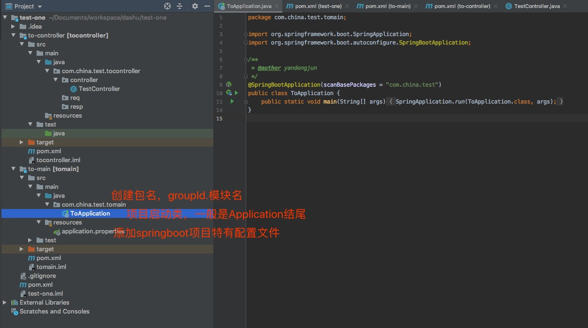
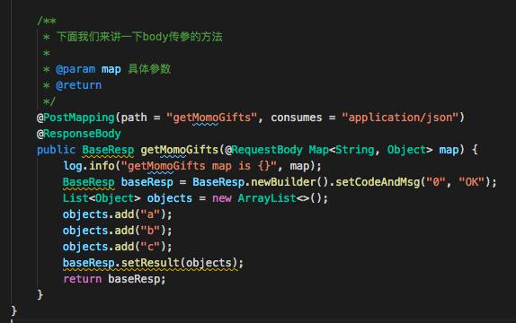
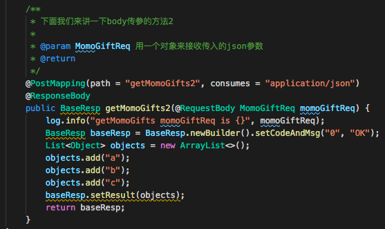

# Spring Boot Sample Project

<!-- TOC -->

- [Spring Boot Sample Project](#spring-boot-sample-project)
    - [多模块spring boot2.0项目搭建](#多模块spring-boot20项目搭建)
        - [创建SpringBoot 2.0项目](#创建springboot-20项目)
        - [创建多模块](#创建多模块)
        - [项目启动](#项目启动)
    - [第一个restful接口](#第一个restful接口)
        - [定义一个restful接口](#定义一个restful接口)
        - [RequestMapping基础用法](#requestmapping基础用法)
        - [RequestMapping处理多个url](#requestmapping处理多个url)
        - [RequestMapping中带参数](#requestmapping中带参数)
        - [RequestMapping中的关键字required, defaultValue](#requestmapping中的关键字required-defaultvalue)
        - [RequestMapping处理各种HTTP方法](#requestmapping处理各种http方法)
        - [RequestMapping通过url获取参数](#requestmapping通过url获取参数)
        - [RequestMapping通过RequestBody来传递参数](#requestmapping通过requestbody来传递参数)
        - [RequestMapping通过RequestBody来传递参数2](#requestmapping通过requestbody来传递参数2)
        - [总结](#总结)
    - [如何在Dao层与数据库打交道](#如何在dao层与数据库打交道)
        - [使用SpringBoot自带的功能快捷的查询数据库数据(未完成，先不看)](#使用springboot自带的功能快捷的查询数据库数据未完成先不看)
        - [使用mybatis插件帮我们自动生成数据库操作语句](#使用mybatis插件帮我们自动生成数据库操作语句)
            - [配置](#配置)
            - [使用](#使用)
    - [手动修改maven项目版本号](#手动修改maven项目版本号)
    - [附录](#附录)

<!-- /TOC -->

```text
这是一个spring boot的示例项目，用以展示spring boot之美
```

## 多模块spring boot2.0项目搭建

```text
创建一个基于spring boot 2.0的多模块maven项目
```

### 创建SpringBoot 2.0项目

1. 打开File -> New -> Project...

2. 输入包名，项目名 group即为包名 artifact为项目名

3. spring boot项目由各种依赖组成，可选一些自己想添加的，也可以不添加，后面我们还可以再添加

4. 设置好项目名之后，我们的项目就搭建完成了

5. 一开始，项目是长这样的，我们删除红框中的所有文件，只留下.gitignore pom.xml .idea test-one.iml这几个文件

6. 最终我们的项目变成了这个样子
记得在pom.xml中如图所示，添加一个打包方式

```text
<packaging>pom</packaging>
```


### 创建多模块

```text
接下来，我们开始创建其它模块，关于java模块怎么划分，
具体可以查看附录中的[java项目分层]这篇文章
```

1. 打开模块创建窗口

2. 我们选择建用maven方式创建模块

3. 输入模块名

4. 确认模块所在目录

5. 完成项目创建，模块最终是这样的

6. 项目最终成型，按相同方法，创建controller, service, dao, common 等模块


### 项目启动

```text
项目基础架构已经搭建完成了，之后就是将项目跑起来
```

1. 修改项目根pom.xml文件(就是最外面的那个pom文件)，我们另外建了一个controller模块


2. 在controller模块的pom文件中添加如下内容，其它文件请参阅项目源码


3. 修改main模块的pom.xml文件，添加如下内容


4. 在main模块中添加以下3个文件(具体文件内容请自行查看项目源码)


5. 启动项目


## 第一个restful接口

```text
SpringBoot项目创建完成之后，可以简单的通过几个注解就完成一个restful接口的定义，我们一起来看一下
```

### 定义一个restful接口

1. 如图，创建一个controller类，并实现一些基础的方法

```text
需要说明的是
application.properties里配置项
#系统名称
server.servlet.context-path = /ts
#sso系统服务地址
server.port = 8889

平常访问链接，需要
http://ip:{server.port}/{server.servlet.context-path}/
某个controller的外层path/方法path

例：
http://localhost:8889/ts/test/getSomething
```


2. 我们来尝试一下接口调用


### RequestMapping基础用法

```text
感觉一下图例中的2个链接的结果我们不难发现，
http://localhost:8889/ts/test是404没有定义
http://localhost:8889/ts/test/ 可正常返回结果
```


### RequestMapping处理多个url

```code
    /**
     * http://ip:port/ts/test/
     * http://ip:port/ts/test/get
     * http://ip:port/ts/test/get1
     * http://ip:port/ts/test/get2
     * 
     * @return
     */
    @RequestMapping(path = { "get", "get1", "get2" })
    public String get0() {
        return "OK";
    }
```

### RequestMapping中带参数


### RequestMapping中的关键字required, defaultValue


### RequestMapping处理各种HTTP方法

```text
常用的HTTP METHOD

后面的method可省略，用GetMapping等代替
```


### RequestMapping通过url获取参数

```text
restful接口的精髓在于通过url来获取参数，如

http://ip:port/ts/test/get/userinfo/1

http://ip:port/ts/test/get/userinfo/{userId}

```


### RequestMapping通过RequestBody来传递参数

```text
restful接口可通过http的body来传递参数，如
http://localhost:8889/ts/test/getMomoGifts
```




### RequestMapping通过RequestBody来传递参数2

```text
restful接口可通过http的body来传递参数，如
http://localhost:8889/ts/test/getMomoGifts2

这里与上面不一样的地方在于，上面直接将传入的json数据转成了map，我们这个方法将json数据转成一个对象
```




需要说明的是，json中的key值要与对象中的参数的名字一样才能被识别

```json
{
    "userName":"yandongjun",
    "age":18
}
```


### 总结

```text
本章我们讲了如下内容
1. http有哪些方法
2. 同样的定义可以有不一样的写法，如method = post可替换成直接用PostMapping
3. 可以用url来对参数进行传递
4. RequestBody传递参数时，Key传要与对象中的属性名称一致才可以被识别
```

## 如何在Dao层与数据库打交道

```text
本章节，我们地讲解
1. 如何使用SpringBoot自带的功能快捷的查询数据库数据
2. 如何使用mybatis框架帮我们自动生成数据库操作语句并完成查询
3. 如何使用mybatis编写自定义的sql语句
```

### 使用SpringBoot自带的功能快捷的查询数据库数据(未完成，先不看)

1.首先，我们要在parent模块的pom.xml文件中引入数据库相关的jar包

```text
<dependency>
    <groupId>mysql</groupId>
    <artifactId>mysql-connector-java</artifactId>
    <version>8.0.17</version>
</dependency>
```

2.在main模块的application.properties文件中，我们需要配置数据库相关的配置

```text
```

### 使用mybatis插件帮我们自动生成数据库操作语句

在开始这一章节之前，我们假设已经完成了数据库的创建，表的创建

#### 配置

1.首先，我们在dao层添加一些依赖,先在parent下的pom中进行定义，之后在dao模块进行引用(这里不作赘述，注意版本号)

```text
       <dependency>
            <groupId>org.mybatis.spring.boot</groupId>
            <artifactId>mybatis-spring-boot-starter</artifactId>
        </dependency>

        <dependency>
            <groupId>org.springframework.boot</groupId>
            <artifactId>spring-boot-starter-jdbc</artifactId>
        </dependency>

        <dependency>
            <groupId>mysql</groupId>
            <artifactId>mysql-connector-java</artifactId>
            <scope>provided</scope>
        </dependency>
```

2.其次，我们得把Mybatis自动生成文件的插件引用进来

```text
    <build>
        <plugins>
            <plugin>
                <groupId>org.mybatis.generator</groupId>
                <artifactId>mybatis-generator-maven-plugin</artifactId>
                <version>${mybatis-generator-maven-plugin.version}</version>
                <dependencies>
                    <dependency>
                        <groupId>mysql</groupId>
                        <artifactId>mysql-connector-java</artifactId>
                        <version>${mysql-driver.version}</version>
                    </dependency>
                </dependencies>

                <configuration>
                    <!-- 大家注意，这里的目录其实就是dao模块下的resources目录 -->
                    <configurationFile>src/main/resources/autogen/generatorConfig.xml</configurationFile>
                    <overwrite>true</overwrite>
                </configuration>
            </plugin>
        </plugins>
    </build>
```

3.接下来，我们添加插件需要使用到的文件 generatorConfig.xml,观察一下上面插件的引用，里面的configuration
配置了这个文件的路径

```text
        <!-- 配置domain类的包名 -->
        <javaModelGenerator targetPackage="com.china.test.sample.tsdao.tsdb.domain"
                            targetProject="src/main/java/"><!-- src/generated/java -->
            <property name="enableSubPackages" value="true"/>
            <property name="trimStrings" value="true"/>
        </javaModelGenerator>

        <!-- 配置mapper.xml文件的路径 -->
        <sqlMapGenerator targetPackage="tsdb"
                         targetProject="src/main/resources/sqlmap/"> <!-- src/generated/resources -->
            <property name="enableSubPackages" value="true"/>
        </sqlMapGenerator>

        <!-- 配置mapper类的包名 -->
        <javaClientGenerator type="XMLMAPPER" targetPackage="com.china.test.sample.tsdao.tsdb.mapper"
                             targetProject="src/main/java/"> <!-- src/generated/java -->
            <property name="enableSubPackages" value="true"/>
        </javaClientGenerator>

        <!-- 配置要自动生成的表, 后面的domainObjectName就是生成的java类的名称 -->
        <table schema="test" tableName="ts_test" domainObjectName="TsTest">
            <property name="useActualColumnNames" value="true"/>
        </table>
```

4.开始生成文件

```text
4.1 数据库建表，可以使用init.sql文件中的建表语句，也可以使用自己自定义的建表语句
4.2 使用如下方式生成文件(需要在dao模块的根目录下，就是有pom.xml文件的目录下)
mvn mybatis-generator:generate
```


```text
也可以使用idea自带的插件执行, 如下图所示
```


#### 使用

1.先确定自动生成的文件在哪

```text
我们在生成文件之后，大家可以在这3个目录下看到相应的文件
domain类目录
src/main/java/
com.china.test.sample.tsdao.tsdb.domain

mapper类目录
src/main/java/
com.china.test.sample.tsdao.tsdb.mapper

mapper.xml文件目录
src/main/resources/sqlmap/tsdb

如下图
```


2.如何让springboot项目知道这3种文件在哪

```text

```

## 手动修改maven项目版本号

```text
1、修改版本
　　mvn versions:set -DnewVersion=xxxx
2、回滚版本，提交后不能回滚
　　mvn versions:revert
3、提交版本变更
　　mvn versions:commit
```

## 附录

[spring-boot 多模块项目搭建](https://symonlin.github.io/2019/01/15/springboot-1/)

[java项目分层](https://www.jianshu.com/p/9ef2005a0001)
